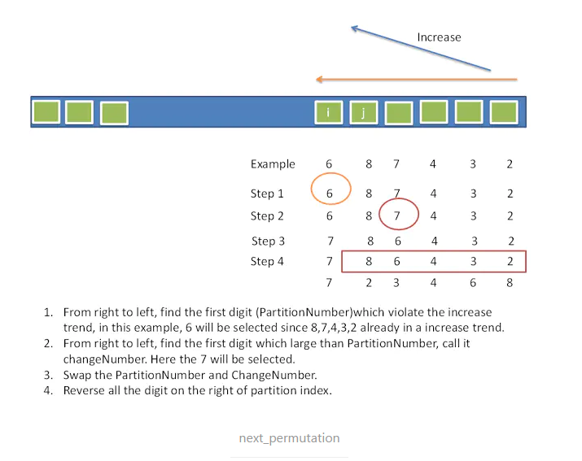

# Algorithm 相关题目题解

## 2020-03

### 下一个排列 next_permutation

#### 背景

- 例子：6，8，7，4，3，2。
- 目标：生成新的排列，比旧的大，且增大的幅度最小。

#### 算法



#### 解释

1. 第一步，从右到左进行扫描，发现第一个违背递增趋势的数字，称之为`PartitionNumber`，即上例中的6。
2. 第二步，从右到左进行扫描，发现第一个比 `PartitionNumber` 大的数，称之为`ChangeNumer`，即上例中的7。注意，这个数一定存在，不然不会有`PartitionNumber`。
3. 交换`PartitionNumber`和`ChangeNumer`，使新的排列别旧的大，但增大的幅度不一定是最小的。
4. 反转`PartitionNumber`右侧的数，此时`PartitionNumber`右侧的排列是严格的从大到小排列，如此反转后可以保证新排列的增大幅度是最小的。（找到正确的位置，把脑袋变大，然后把身体设置为最小，即增大又保证最小的增大）

#### 实现

- 实现四个函数，分别做`findPartition`，`findChange`，`Swap`和`Reverse`
- 注意：`findPartition`返回partition number的index，如果是-1，则表示输入的数组已经是最后一个排列，即从大到小，直接`reverse`后返回即可
- 注意：可能存在重复的number，所以在两个find函数中，要判断大小时要使用 `>=` 或者 `<=`

```c++
class Solution {
public:
    void nextPermutation(vector<int>& nums) {
        // func1(nums);
        return func2(nums);
    }

    void func1(vector<int>& nums) {
        next_permutation(nums.begin(), nums.end());
    }

    void func2(vector<int>& nums) {
        int partition_index = findPartition(nums);
        if (partition_index == -1) {
            reverse(nums, 0, nums.size()-1);
            return;
        }
        int change_index = findChange(nums, partition_index);
        swap(nums, partition_index, change_index);
        reverse(nums, partition_index+1, nums.size() - 1);
    }

    // return partition number index
    int findPartition(vector<int>& nums) {
        int i = nums.size() - 2;
        while (i >= 0 && nums[i] >= nums[i+1]) {
            i--;
        }
        // cout << "findPartition i=" << i << endl;
        return i;
    }
    // return change number index
    int findChange(vector<int>& nums, int partition_index) {
        int i = nums.size() - 1;
        while (i > partition_index && nums[i] <= nums[partition_index]) {
            i--;
        }
        // cout << "findChange i=" << i << endl;
        return i;
    }

    void swap(vector<int>& nums, int i, int j) {
        int temp = nums[i];
        nums[i] = nums[j];
        nums[j] = temp;
        return;
    }

    void reverse(vector<int>& nums, int lo, int hi) {
        while (lo < hi) {
            swap(nums, lo, hi);
            lo++;
            hi--;
        }
        return;
    }
};
```